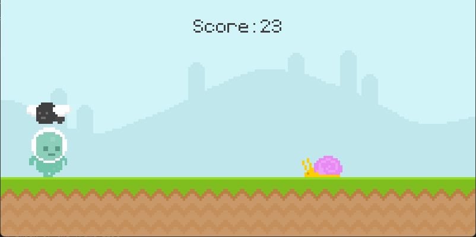

## The ultimate introduction to Pygame

This is a tutorial provided by Clear Code that brings an introduction to creating a simple 2D game. 

In this tutorial you will learn to create a runner game in Python with Pygame. The game itself isn't the goal of the video. Instead, I will use the game to go through every crucial aspect of Pygame that you need to know to get started. By the end of the video, you should know all the basics to start basically any 2D game, starting from Pong and ending with the first generation of Doom and Wolfenstein 

Link to youtube video: [The ultimate introduction to Pygame](https://www.youtube.com/watch?v=AY9MnQ4x3zk)

Link to Clear Code Github: [Clear Code](https://github.com/clear-code-projects)